# Render 服务部署教程

## 作者：刘桐玮

### 前置

首先登录 [Render](https://render.com/)，点击右上角，开始注册：


随后，进入控制台。

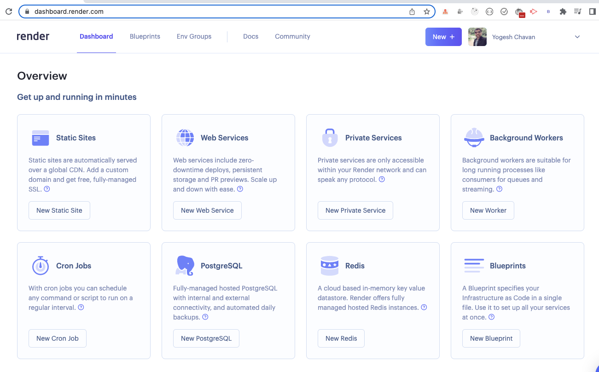

为了可以部署服务，用户需要有 [Gitee](https://gitee.com/) 账户，并且将 [原仓库](https://gitee.com/oier-meet-dev-team/oier-meet) 导入到 Github/Gitlab。

### 前端部署

进入 "Static Sites" 来部署静态网站，在侧边栏登录 Github/Gitlab，并选择仓库：

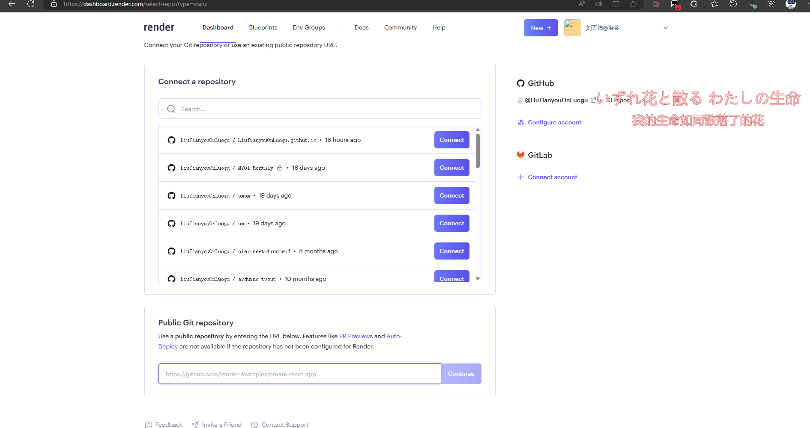

按照图示配置仓库、分支、发布目录：

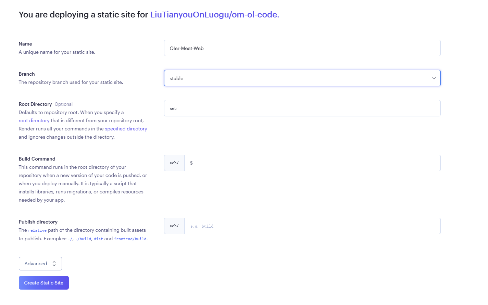

如果有域名的话，请执行下面几步；否则请直接使用自动生成的 https://<名称>.onrender.com 形式的域名。

然后进入 "Settigs" -> "Custom Domains"，输入自定义域名：

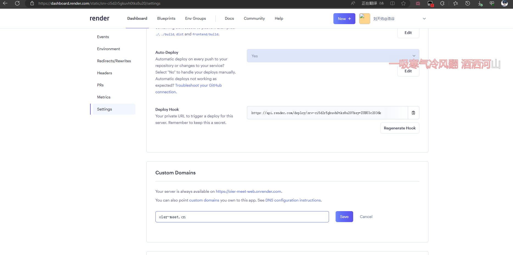

然后配置 DNS（因 DNS 服务商而异）：

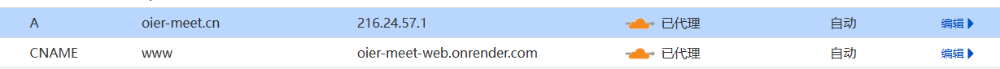

返回，验证域名生效即可。

### 后端部署

点击右上角的加号，选择 "Web Service"，还是选择 Fork 仓库。

然后继续，按照图示配置：


更正：命令应为：

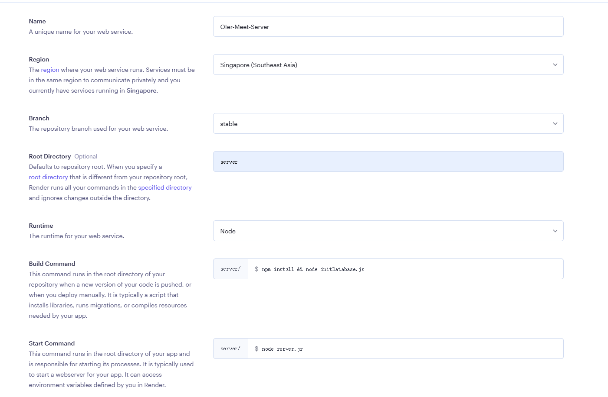

如已经部署，请在设置中更改。

重复上述步骤，绑定域名即可。

稍等 —— 我们需要部署数据库！

### 数据库部署

首先打开 [mongodb](https://www.mongodb.com/atlas/database)：

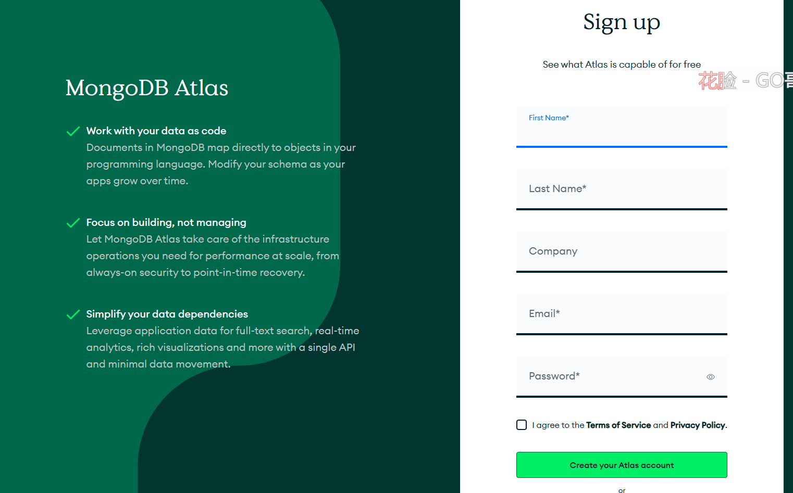

这个页面选择 "Manual"，继续：

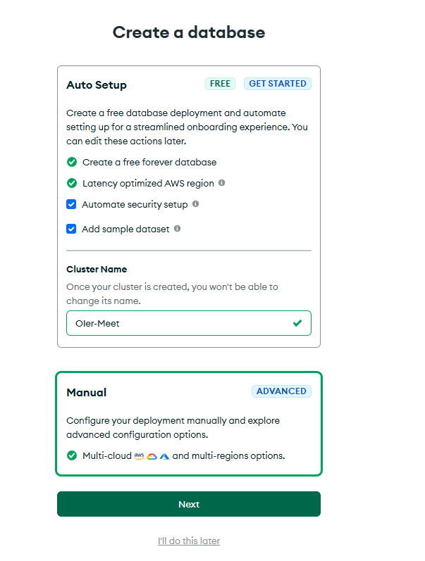

如图所示，配置数据库：

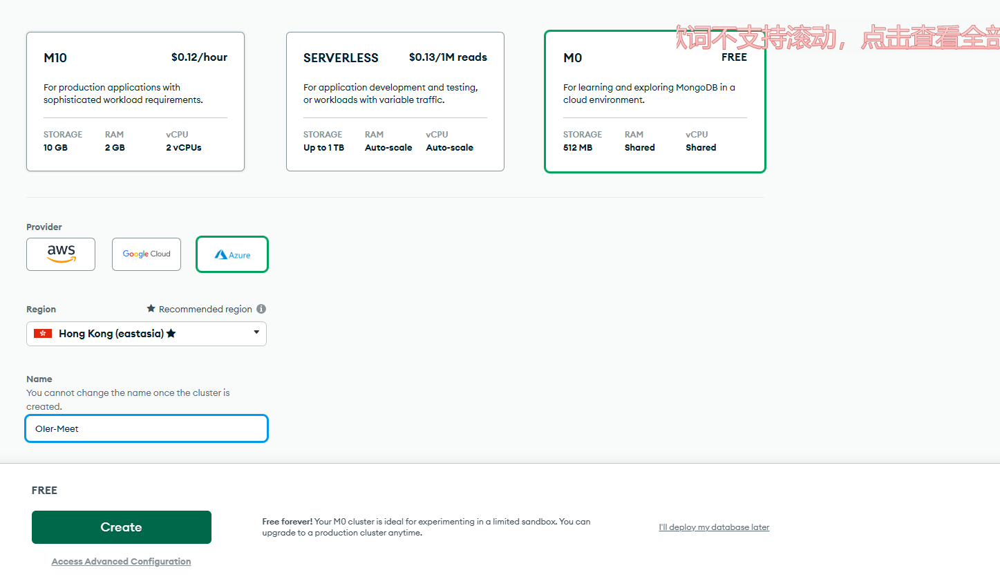

在接下来的安全页中输入账号密码之类的，继续：

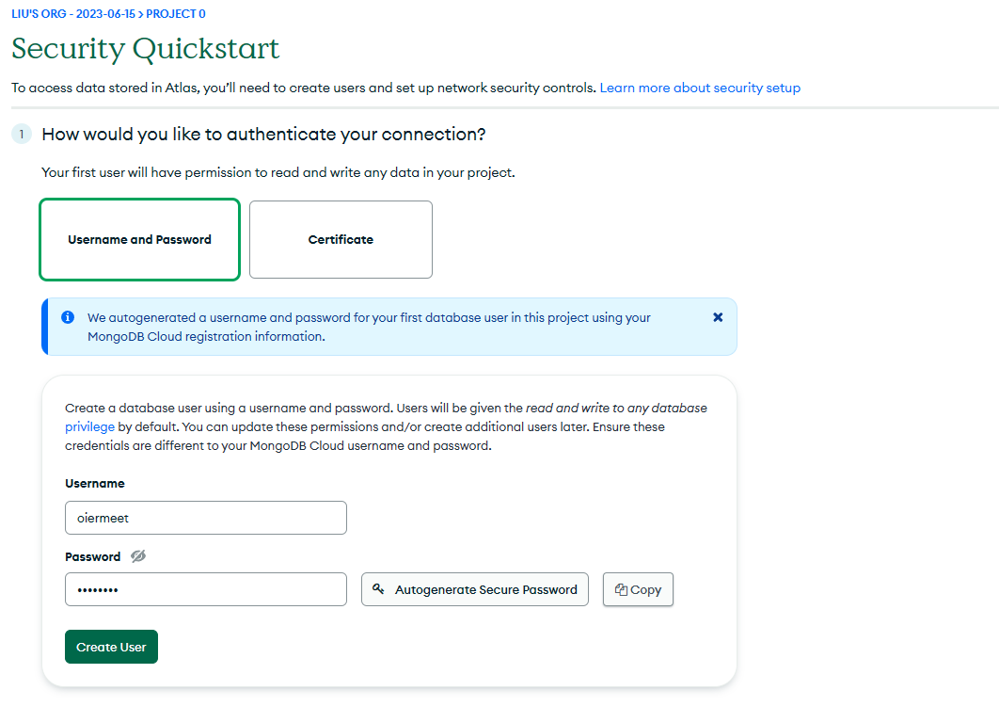

接下来，选择云服务，并且获取 IP，输入到白名单：

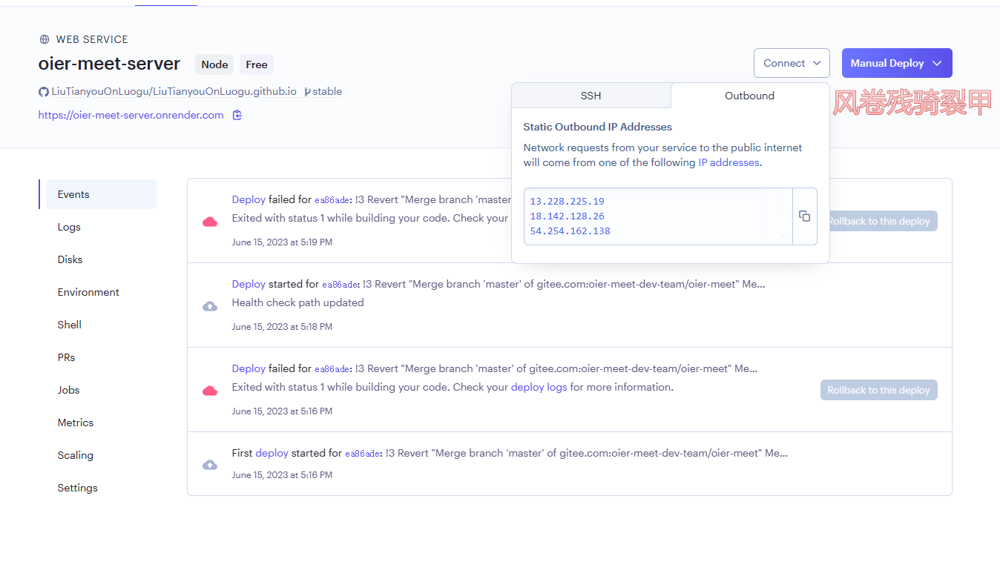

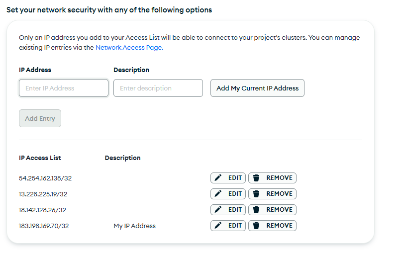

确定之后，进入数据库主界面，点击 "Connect"，弹出对话框：

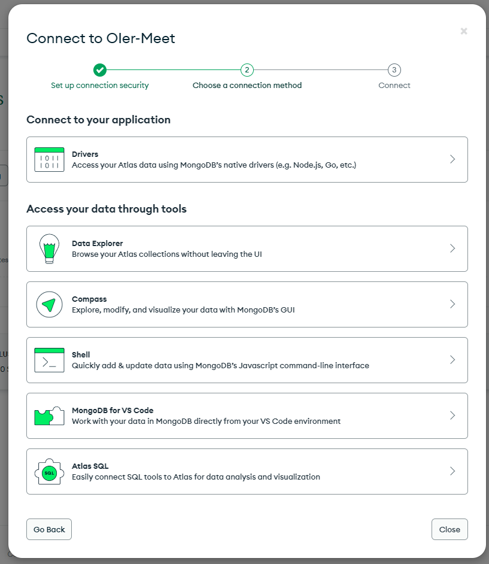

选择第一个，继续：


复制显示的 URI，完成。

将显示的 URI 放到 Fork 的仓库里的配置文件（config.json），如：

```javascript
"database": {
    "url": "mongodb+srv://oiermeet:<password>@oier-meet.oysovax.mongodb.net/?retryWrites=true&w=majority",
    "db": "oiermeet"
},
```

克隆仓库到本地，提交更改即可。